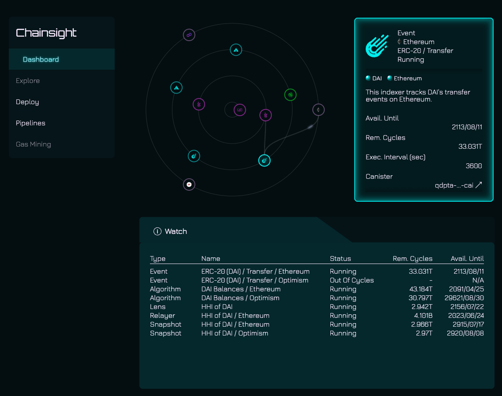
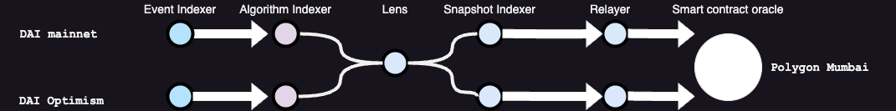

# demo-hhi-oracle

Chainsight platform demo to use it as an HHI oracle.
This is the first PoC of Chainsight platform to demonstrate how to use it as an `multi-chain oracle`.
With Chainsight, you can easily aggregate ERC20 transfer events, restore the token holder's balance, and calculate the HHI of the token holder's distribution, and put them into other chains.
In this demo, we use the [Chainsight](https://chainsight.network) platform to calculate the HHI of the top 10 DAI holders on the Ethereum and Optimism network.

## Working demo

[Demo](https://demo1.chainsight.network/)

## Design

## Canisters

### Event indexer

[Event indexer](indexer/src/indexer) is triggered by timer, indexes transfer events from EVM-compatible chains and store as a hashmap of block number and events.
Event indexers have [pub-sub model](https://internetcomputer.org/docs/current/motoko/main/sharing#publisher-subscriber-pattern-with-actors) and publish transfer events to subscribers.

### Algorithm indexer

[Algorithm indexer](indexer/src/mapping) subscribes to the transfer events from the event indexer, use them to calculate the balance of token holders and store them as a hashmap of address and balance.

### Lens

[Lens](indexer/src/hhi) is a view-only canister that provides the HHI of the token holder's distribution.
It uses Algorithm indexer to get the token holder's balance.

### Snapshot indexer

[Snapshot Indexer](indexer/src/hhi_snapshot/) is triggered by timer, takes a snapshot of HHI.
It uses Lens to get the current HHI and store it as a hashmap of current timestamp and HHI.

### Relayer

[Relayer](indexer/src/relayer/) is triggered by timer, relays the current HHI to other chains.
It uses Snapshot Indexer to get the current HHI.
It calls [Oracle Contract](oracle/contracts/OracleV1.sol) in other chains to put them, using [Chain-key signatures](https://internetcomputer.org/how-it-works/threshold-ecdsa-signing/).

## How to run

1. Deploy the [Oracle Contract](oracle/contracts/OracleV1.sol) to the target chain.
1. Deploy canisters by `dfx deploy`
1. Sync transfer events to current block by `npx ts-node indexer/src/update_indexer_events/index.ts`

## HHI(Herfindahl-Hirschman Index)

The Herfindahl-Hirschman Index (HHI) is a measure of market concentration and competition among market participants. The HHI is calculated by squaring the market share of each firm competing in the market and then summing the resulting numbers. For example, for a market consisting of four firms with shares of 30, 30, 20, and 20 percent, the HHI is 2,600 (30^2 + 30^2 + 20^2 + 20^2 = 2,600). The HHI takes into account the relative size distribution of the firms in a market and approaches zero when a market consists of a large number of firms of relatively equal size. The HHI increases both as the number of firms in the market decreases and as the disparity in size between those firms increases.
  
$$ HHI = \sum_{i=1}^{n} s_i^2 $$

## More information

- About Chainsight
  - [Introduction - Chainsight Network](https://docs.chainsight.network/)
